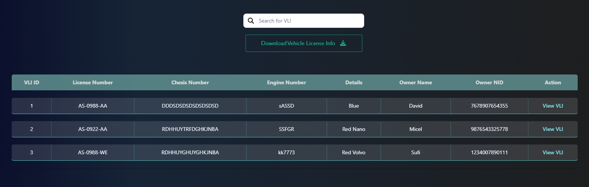
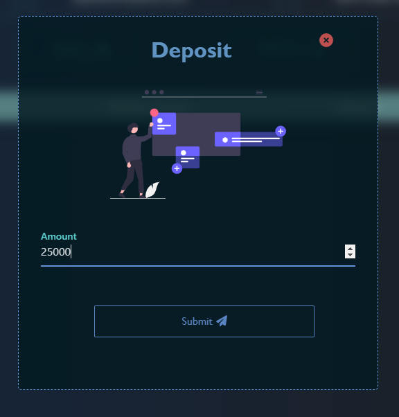
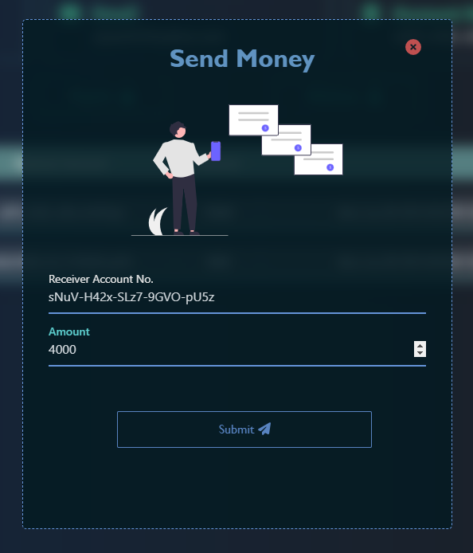
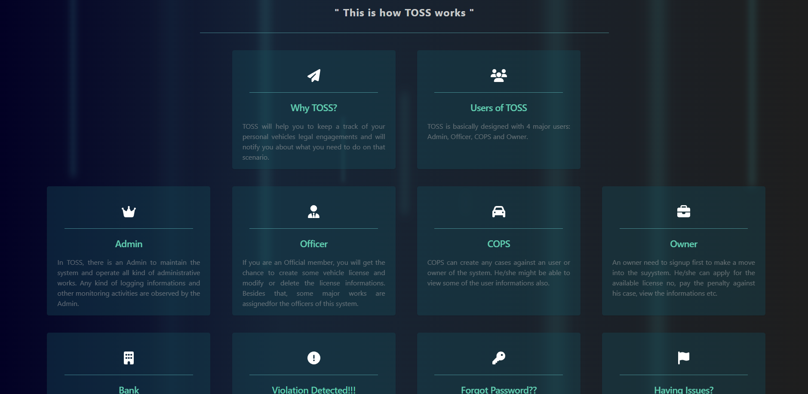
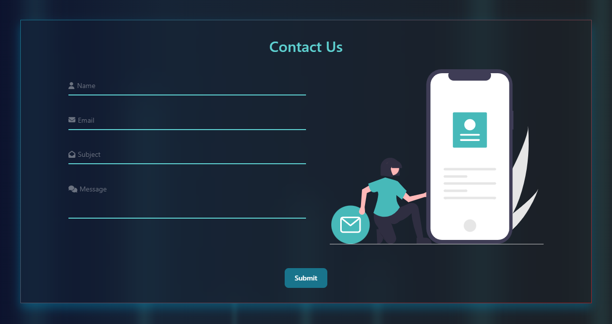

# Traffic Operation Surveillance System (TOSS)

| WELCOME TO TOSS (TRAFFIC OPERATION SURVEILLANCE SYSTEM) |

 ---------------
| Introduction |
 ---------------

TOSS is a traffic violation management system for regular people, where necessary action is taken in the event of a violation. TOSS is a web application built with Node.js. With TOSS, it is now easy to manage traffic violations and vehicle license registration. Everything is now simple to do: report any problems, obtain violation information, bring a lawsuit against drivers, obtain owner information, and pay your fine. To assure users' service and security, admin will keep an eye on and manage all user activity.

Thank you everyone.

>> YouTube video link:

-------------------
| Required System |
-------------------

 >> Any version of windows operating system which is compatible to run Visual Studio Code.
 
 >> Visual Studio Code
 
 >> PostgreSQL management tool pgAdmin 4

--------------------------
| Minimum Specifications |
--------------------------

    1. Operating System : Windows® 7/8/10/11
    2. Processor	: Intel® Core™ i3
    3. Memory		: 2 GB RAM
    4. Graphics		: Not Required
    5. Network		: Broadband Internet Connection
    6. Storage		: 3 GB

---------------------------
| How to run [Using .bat] |
---------------------------

 >> Open "pgAdmin 4" and connect your device to server by giving user password.
 
 >> Create a database named "TOSS".
 
 >> Open "TOSS" folder and open "START.bat" file.
 
 >> Go to any web browser and type "localhost:8000".

 >> This will load the project's home page and give access to "TOSS".
 

-----------------------
| How to use "TOSS" |
-----------------------

 >> First, to get the best experience, make sure your screen size is '100%'.
 
 >> To explore TOSS, at first you must Sign up as Owner with proper information.
 
 >> For entering email, a valid email is required.
 
 >> To enter initially as Admin in the system use user name "toss" and password "ADad<2020>".

 >> To change profile picture, a single tap on choose file is enough.

 >> If you forgot your password, enter the valid OTP to change the password.

 >> Before withdrawing or sending money , first deposit money in the account.

 >> If you are Owner, Please register your vehicle license no. first.
 
 >> For mobile number, you have to give a valid mobile number. 
 
 >> You must fill all the required field.
 
 >> After Sign up, Log in to your profile and explore.

 >> And especially do not violate any traffic rules and ensure a safe environment.*** 
 
 >> There are 4 type of users - Admin, Officer, Cops and Owner. 

   Admin ~

           1. Profile                      ~ User's profile is shown here. Every user can edit profile, change password and update profile pictutre.
	   2. Manage Officer               ~ Admin can add and view officer here. Also, update officer, ban officer and delete officer option is given for all officers.
           3. Monitoring                   ~ Track activities all actions, view and search all user, transaction, bank, case, vli details. An extra feature is given to Admin that export any data.
           4. Manage Reports               ~ All pending and closed reports are shown here.
           5. Log History                  ~ Admin's all log in and log out history is given here.

   Officer ~
      
           1. Profile                      ~ User's profile is shown here. Every user can edit profile, change password and update profile pictutre.
	   2. Manage Officer               ~ Officer can add and view cops here. Also, update cops and delete cops option is given for all cops.
           3. Manage Vli                   ~ Officer can register and view vli here. Also, update vli and delete vli option is given for all vlis.
           4. Account                      ~ Withdraw money from account and view all transactions.
           5. View All                     ~ View and search Officer, Owner, Cops, case and vli details. An extra feature is to export any data.
           6. Report                       ~ Report any problem to Admin.
           7. Log History                  ~ Officer's all log in and log out history is given here.

         
   Cops ~
           
           1. Profile                      ~ User's profile is shown here. Every user can edit profile, change password and update profile pictutre.
	   2. Manage Cases                 ~ Cops can add and view cops here. Also, update case and delete case option is given for all cops.
           3. View All                     ~ View and search Officer, Owner, Cops, case and vli details. An extra feature is to export any data.
           4. Report                       ~ Report any problem to Admin.
           5. Log History                  ~ Cops's all log in and log out history is given here.

   Owner ~
           
           1. Profile                      ~ User's profile is shown here. Every user can edit profile, change password and update profile pictutre.
	   2. Apply Vli                    ~ Apply to register your car's vehicle license no. 
	   3. Cases                        ~ Owner can see the filed cases and previous cases against him/ her.
           4. Account                      ~ Deposit, Withdraw or Send money is possible from here and owner can view all transactions.
           5. View All                     ~ View and search Officer, Owner, Cops details.
           6. Report                       ~ Report any problem to Admin.
           7. Log History                  ~ Owner's all log in and log out history is given here.

 > There are some other options for TOSS Users.

   TOSS Options~

           1. About                        ~ This will give a brief description of TOSS features. 
           2. Meet The Team                ~ To know about developers here is meet the team.
           2. Contact Us                   ~ Contact with admin for any issue.

---------------------------
| Background Informations |
---------------------------

The modern world is all about technology. This digitalization also can be seen in the field of Traffic Violation Control. Nowadays, there are a lot of vehicles running on the roads. It is a necessary thing for everyone to move from one place to another. It saves time and energy, too. But managing these things is a bigger challenge now. 

Now a days we can see there are a lot of vehicles continuously running on the road. The proportion of Traffic Police and Vehicle is 100:1. In this condition it is really almost impossible for a traffic police to penalize and make a surveillance of all the vehicles. With a view to solve the problem more reliably and flexibly we are introducing Traffic Operation and Surveillance System (TOSS) to improve the system. Moreover, its simplicity and attractive user interface will make sure to provide most accurate results and operations in a less time-consuming way. 

----------------------------
| Developer's Informations |
----------------------------

	 1. Niloy Kanti Paul
	    Email	: niloykantipaul@gmail.com
	    LinkedIn	: https://www.linkedin.com/in/niloy-kanti-paul-5543181ab/
	    Github	: https://github.com/DEV-NKP
	    
	 2. Dipanwita Saha
            Email	: dipanwitasaha7009@gmail.com
	    LinkedIn	: https://www.linkedin.com/in/dipanwita-saha-a772aa215/
	    Github	: https://github.com/Dipanwita-Saha
	    
	 3. Kaushik Biswas
	    Email	: biswaskaushik.2020@gmail.com
	    LinkedIn	: https://www.linkedin.com/in/kaushik-biswas-2b6554243/
	    Github	: https://github.com/Kaushik-Biswas
         
	 4. Fahim Hasan Nilay
            Email	: 
	    LinkedIn	: https://www.linkedin.com/in/fahim-n-28809b113/
	    Github	: https://github.com/Fahim-Nilay

----------------------
| Project Highlights |
----------------------

> TOSS's home page is excellently organized and provides a succinct summary of the company.

> Please fill out this sign up form if you are a vehicle owner.

> Log In to TOSS and get your user access!

> User details are displayed in the Profile section which can be editable. Update your profile picture with just 1 tap!

> Admin has the responsibility to add officer with proper information.

> All Users have their own user card to get short view of profile.

> Export your required data to later give a view on it.

> Owners must apply to vli to register their own car.

> There are three options for Owner in account section. He/She can choose any.

> Cops assign case against traffic violation.

> Every user's details can be seen from the table with one tap!

>> Users can view their log-in and log-out history.

> Owner can get access to the pending and previous cases.

> Account details is shown in a structured way to give best view to users.

> Report any harassment.

> Forgot password? Change it by OTP now...

> Visit the About page to learn more about TOSS's features.

> Admin gets direct message from contact page.

> TOSS has a remarkable designed logo.

********************************************ⒸAll Rights Reserved By team TOSS********************************************

